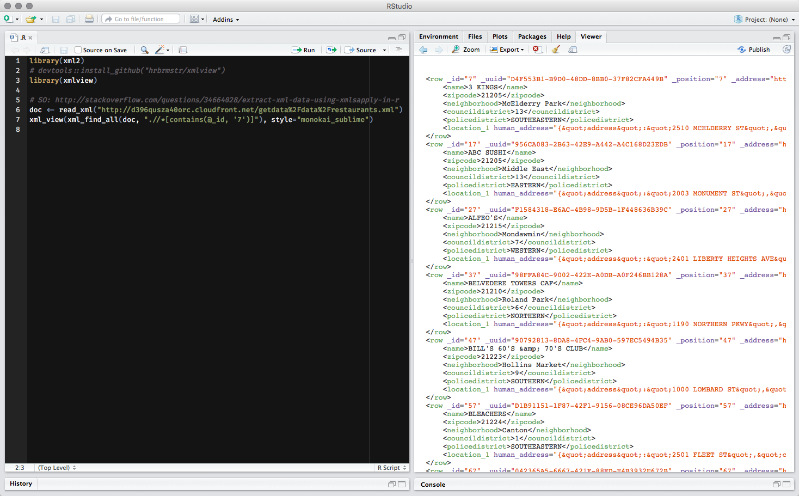

---
output:
  html_document:
    keep_md: true
  md_document:
    variant: markdown_github
---

`xmlview` : View formatted and "pretty printed" HTML/XML in R

It is intended for interactive use. When working with XML data, it's often times
advantageous to be able to see the document and possibly even more advantageous to
see the results of XPath or CSS selector slicing & dicing. 

You can pass in:

- plain character HTML/XML
- an `xml2` `xml_document`
- an `xml2` `xml_nodeset`
- an `xml2` `xml_node`

and view the formatted & pretty-printed result in the RStudio viewer or web browser.

The widget uses  [vkbeautify](http://www.eslinstructor.net/vkbeautify/) and [highlight.js](https://highlightjs.org) to do all the work.

The following functions are implemented:

- `xml_view`: view HTML/XML nodes

### News

- Version 0.3.0 : @timelyportfolio added `xml_tree_view()`
- Version 0.2.2 : added "generate R code" button
- Version 0.2.1 : support for namespaces
- Version 0.2.0 : added `add_filter` option to `xml_view()` for live XPath filtering (so you can see the results immediately and then just copy/paste the XPath string back into R)
- Version 0.1.0 released

### Installation

```{r eval=FALSE}
devtools::install_github("hrbrmstr/xmlview")
```

```{r echo=FALSE, message=FALSE, warning=FALSE, error=FALSE}
options(width=120)
```

### Usage

```{r eval=FALSE}
library(xmlview)
library(xml2)

# available styles
highlight_styles()

# plain character
txt <- "<note><to>Tove</to><from>Jani</from><heading>Reminder</heading><body>Don't forget me this weekend!</body></note>"

xml_view(txt)

# xml document
doc <- read_xml(txt)

xml_view(doc, style="obsidian")
xml_view(xml_find_all(doc, ".//to"), style="github-gist")

xml_view(read_xml(system.file("extdata/dwml.xml", package="xmlview")))
xml_view(read_xml(system.file("extdata/getHistory.xml", package="xmlview")), "androidstudio")
xml_view(read_xml(system.file("extdata/input.xml", package="xmlview")), "sunburst")

# SO: http://stackoverflow.com/questions/34664028/extract-xml-data-using-xmlsapply-in-r
doc <- read_xml("http://d396qusza40orc.cloudfront.net/getdata%2Fdata%2Frestaurants.xml")
xml_view(xml_find_all(doc, ".//*[contains(@_id, '7')]"), style="monokai_sublime")
```

